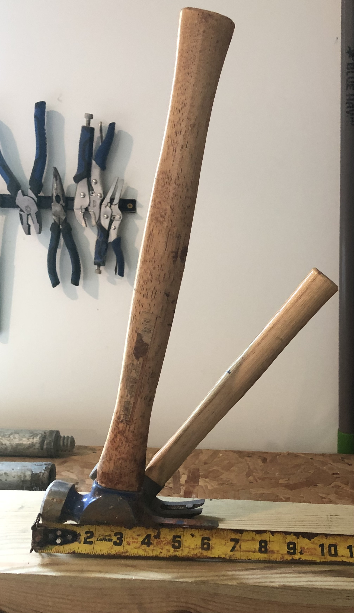
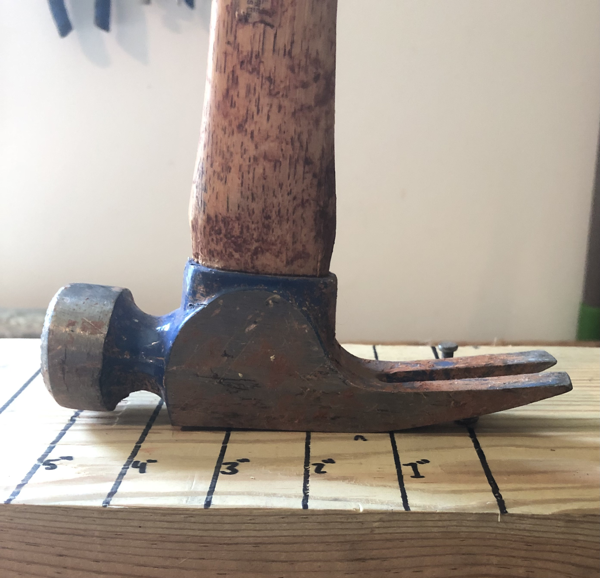
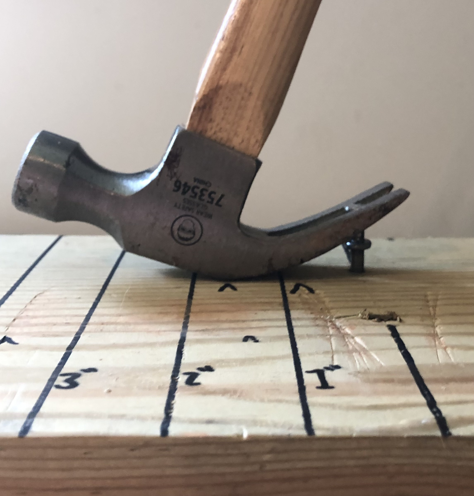
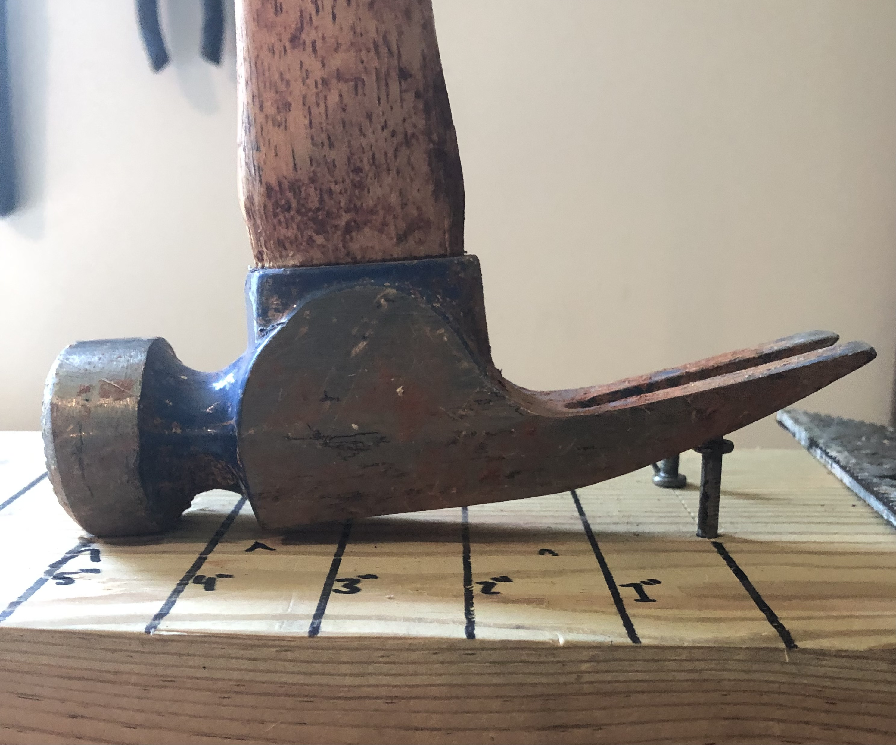
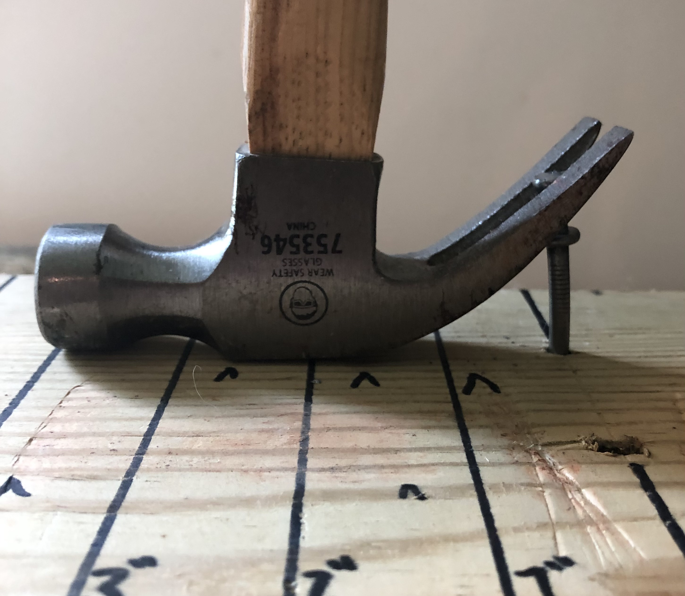

# A1 – Professional Portfolio

## Objective

## Analyze
Portfolio Analysis:

https://www.alexandre-allonas.fr/projects.html
The portfolio homepage provides ease of navigation to many subpages including projects that the engineer has contributed to. The projects available to view give an overview, but do not provide the viewer with a way to replicate the projects. The overviews provide reasoning on component selection to meet specific goals for the projects. The overall portfolio layout and language used appears to be targeting potential employers looking for a broad overview of a candidate and their past contributions. 

https://ross.aleksei.digital/98?ref=emmabostian
This portfolio contains a more unique theme while still providing clear navigation to the creator's projects. The listed projects have short descriptions that provide the goal of the project and some of the software used to design them. The creator's contribution to the projects is clearly shown, but there is no reasoning for why certain programs were used. There is also no timeline of the build process or how to replicate the products produced. The portfolio layout, while somewhat unique, may be viewed as unprofessional to present at an interview. 

Product Analysis:

US5280738A Patent Number  
https://patents.google.com/patent/US5280738A/en (Patent link for adjustable angle claw hammer head)
The product that I am covering is the claw hammer with an adjustable head angle. This improvement to a traditional claw hammer provides the ability for the user to change the angular relationship between the head of the hammer and the handle of the hammer to allow for higher torque to be applied to pull nails and to fit into smaller spaces that claw hammer with a fixed angle claw wouldn't be able to. The claw hammer allows the user to overcome the friction of a driven nail by making the distance from the nail to the pivot point on the hammer small and the distance force can be applied on the handle further from the pivot point. Balancing these moments takes much less force on the hammer handle than the nail. Pulling with enough force on the handle of the hammer will allow for a rotational acceleration that will lift the nail out of the hole. Having a claw hammer with a continuous curve on the claw portion allows for contact on the wood surface to remain close to the nail at all times throughout the pulling motion. This is desired for minimal force to be exerted on the handle of the hammer throughout the duration of the nail pull. However, many times nails can be driven close to objects that may impede the user from positioning the hammer onto the head of the nail. This is where a claw angle close to perpendicular with the handle is desirable because it allows the hammer to be used in smaller spaces to pull nails. This patent allows for the user to be able to have the benefits of many hammer head angles in one tool. This tool would not be necessary if space constraints were not applied to the use case of a hammer.  

As shown, the handle of the hammer with the curved claw protrudes far past the head of the hammer which hooked to the nail. This is the space constraint mentioned. An example would be a 2x4 stud in the way while trying to pull a nail holding framing in place.

The hammer with the curved claw allows for a lower force exerted on the handle of the hammer of the same length. Even with a shorter handle in this instance, the smaller hammer with the curved claw could start to pull the nail with less force than the hammer with the straight claw and longer handle. 

## Decide

## Communicate

