# A3 – Parametric and FEA

## Objective
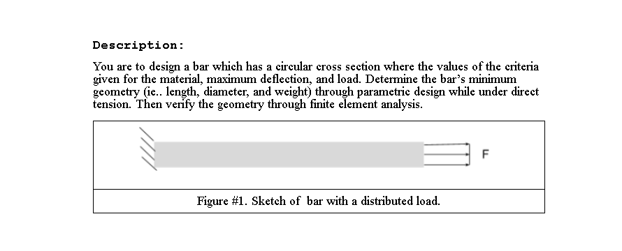
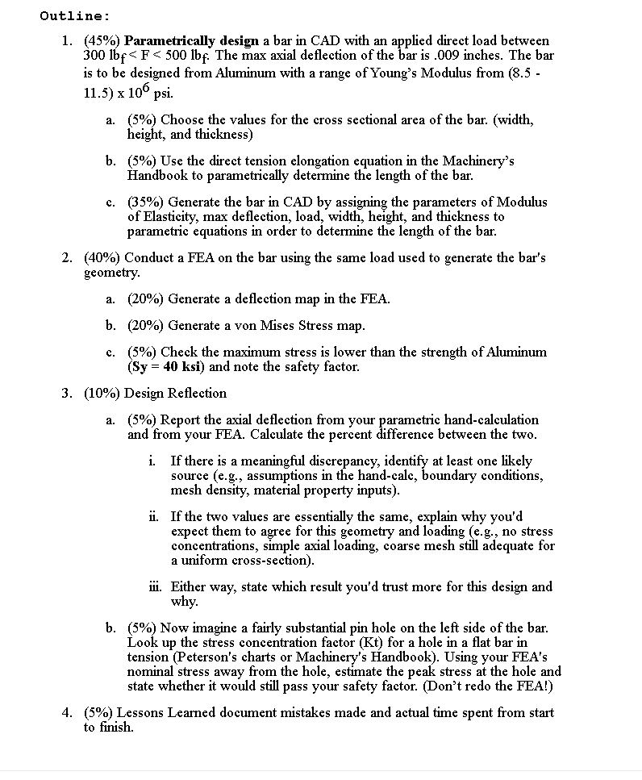

## Analyze

After analyzing the given information, I decided to choose an appropriate material on SolidWorks. I chose 6063 T1 Aluminum, which is in the given modulus range.  

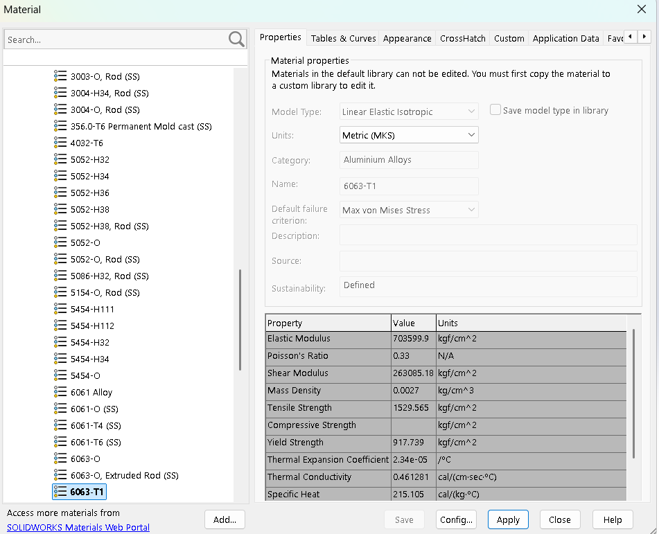

I chose the diameter value to give a relatively short final length value. Originally, I chose one inch, and the length of the bar was extremely long.
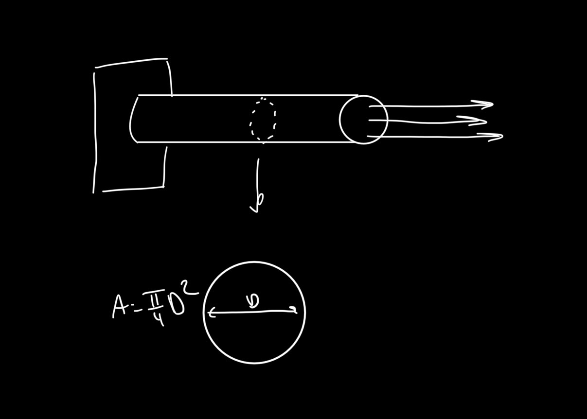
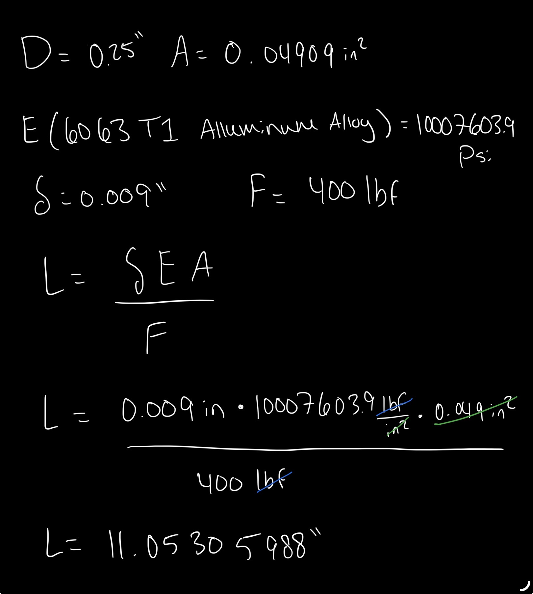

The length of the bar by hand calculations is about 11 inches.

## Decide

The only difficulty that I faced during this assignment was getting the variable equations to calculate properly. I entered all my values in units of inches and the force in pounds of force. When SolidWorks gave me the final length it was incredibly large and wasn't consistent with my hand calculations. I found that I needed to enter my force in units of newtons to get a similar result. I belive this is due to SolidWorks giving answers to calcuations in millimeters even when the input was in inches. 
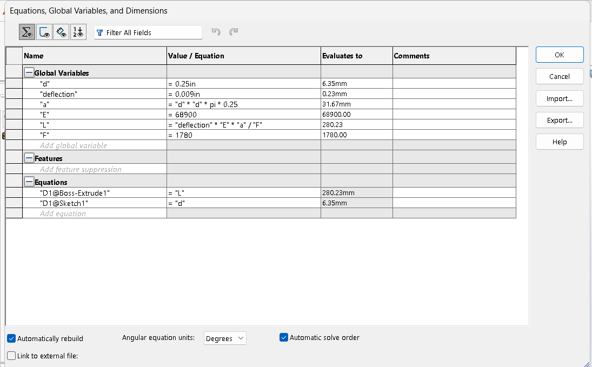 
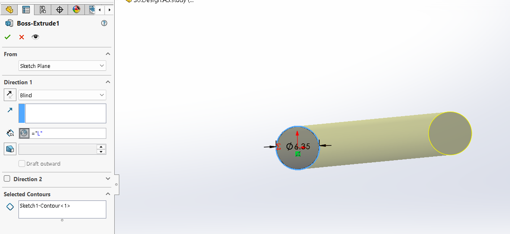

Assigning variables to the dimensions of the sketch and the extrusion length. 

## FEA

Fixing one end of the bar in order to apply the axial force to the other end.

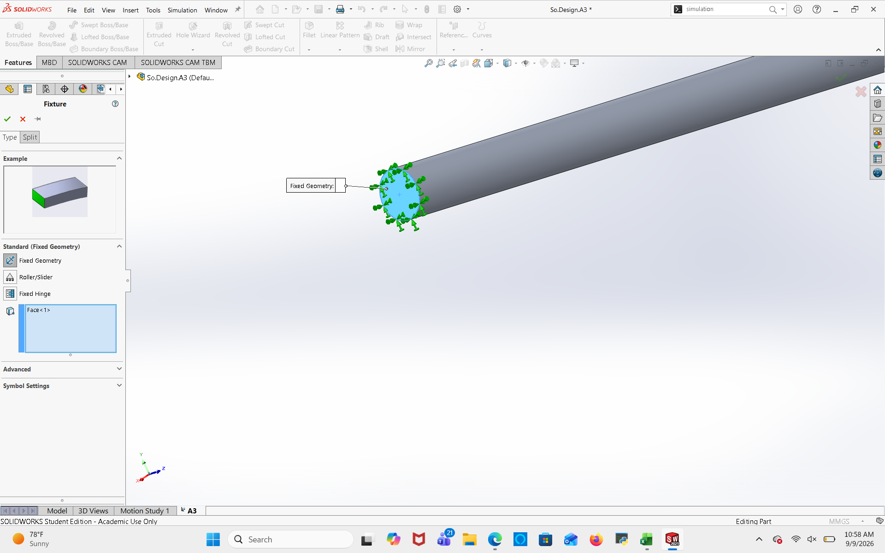

The deflection value maximum was 0.00898 as opposed to the 0.009 value given originally and used in the hand calculations. This can be due to rounding in calculations. 

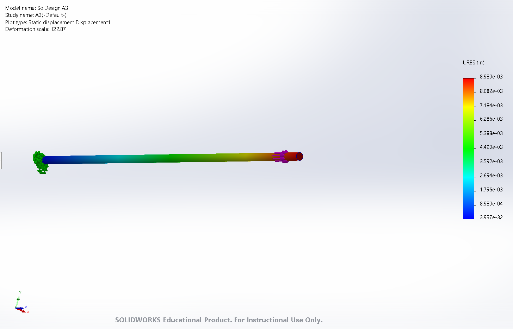
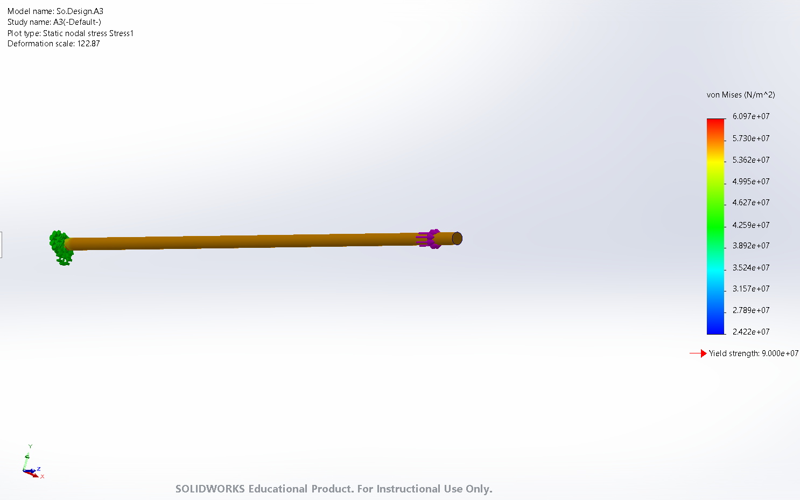

The maximum stress on the bar is about 2/3 of the yield strength of the material chosen. 

## Communicate

The percent error between the two deflection values is 0.22%. This difference is rather small, possibly due to rounding differences between SolidWorks and my calculator. These should be very similar considering that I used a SolidWorks Youngs modulus value, and all other values are the same. I would trust using hand calculated values the most because I can see where any rounding occurs and I can seek out a calculator with high decimal values. 

As for if there was a pin hole transversely through the bar, the Kt factor is about 2.2 for a "substantial" pin. At 2.2 times the stress, this would put the stress higher than the yield strength so there would be plastic deformation or fracturing. 

In total this assignment has taken me about 3 hours from start to finish.

## 2157 Portion

I am going to change the diameter from 0.25 inches to 0.5 inches and make the load 500 lbf.

I am assuming that the length will increase even with the higher force considering the diameter is doubling. 

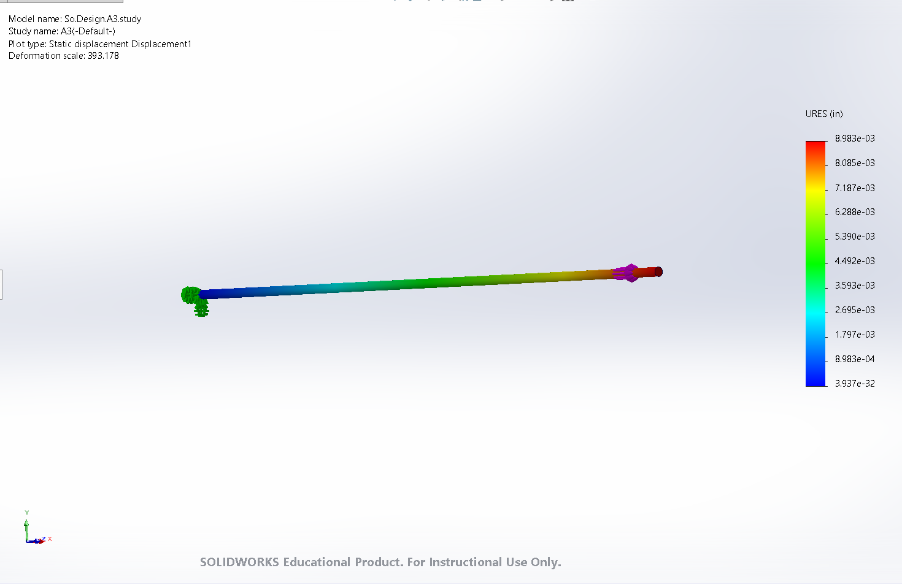
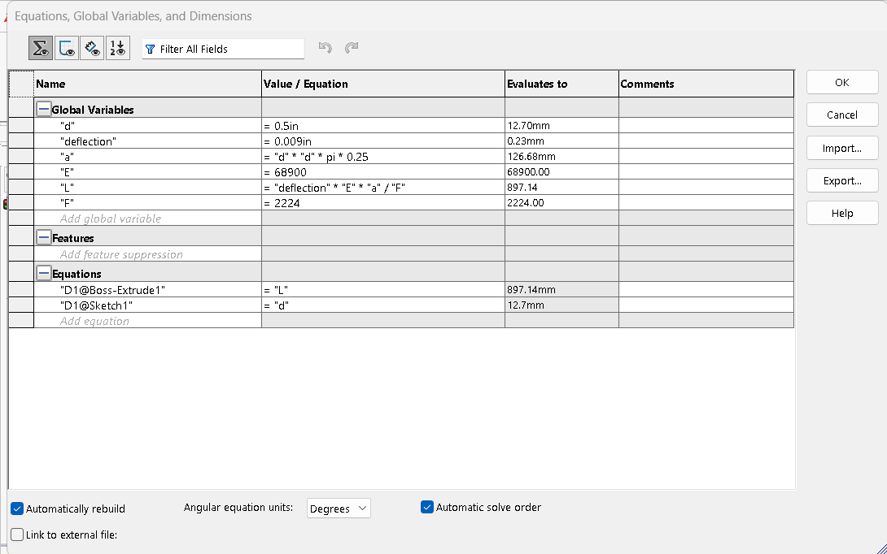

After entering the new values, the length is about 35 inches long and the deformation is still slightly lower than the 0.009 inch deformation value given. Once again, I needed to enter the force value in newtons. 
