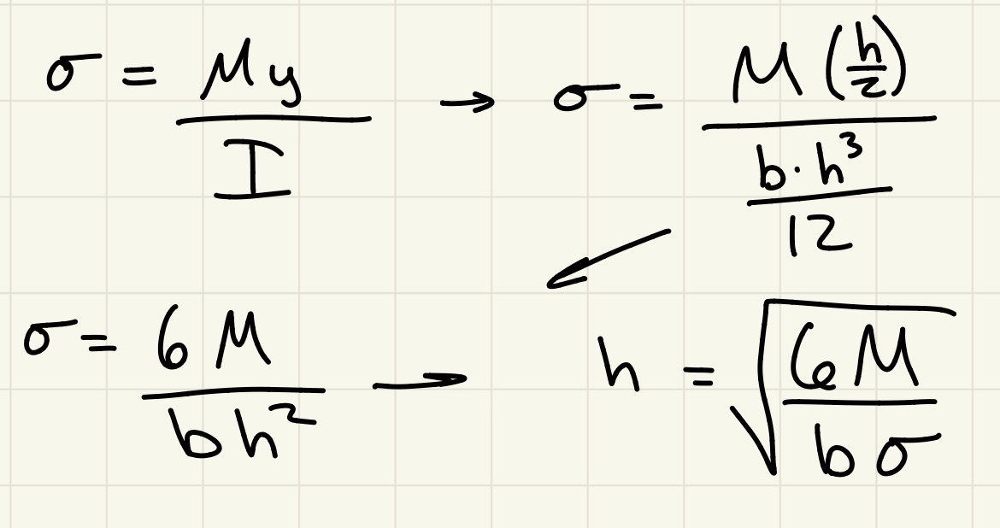
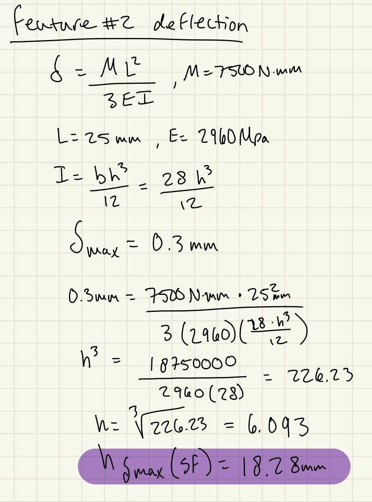
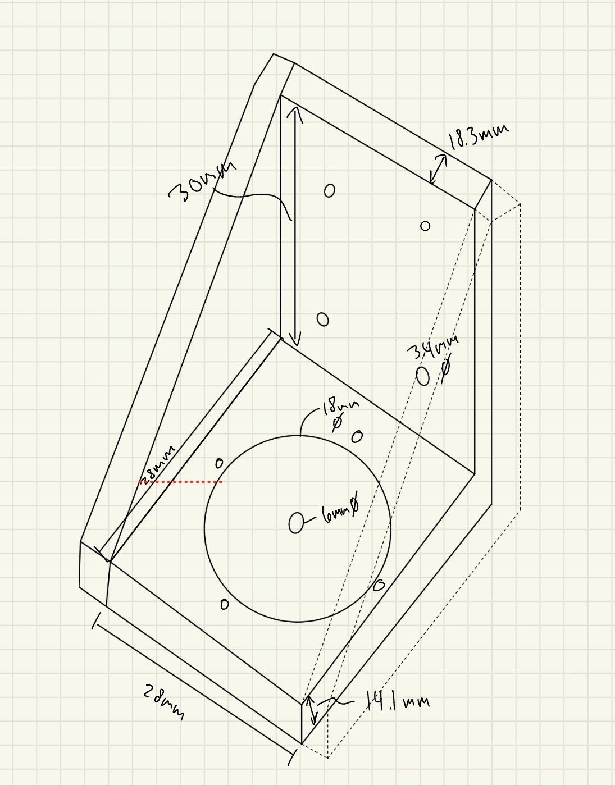
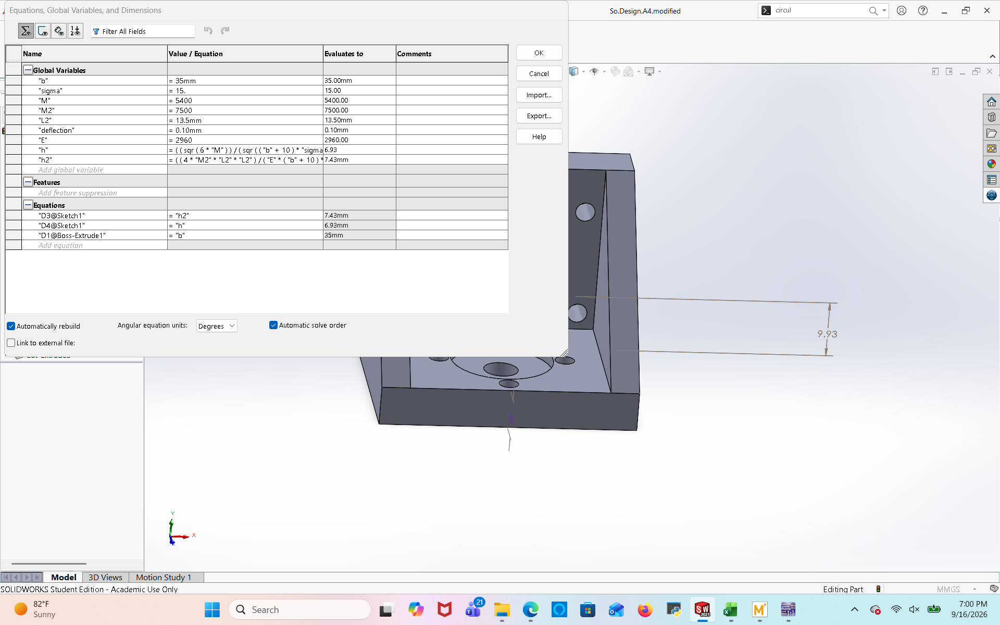
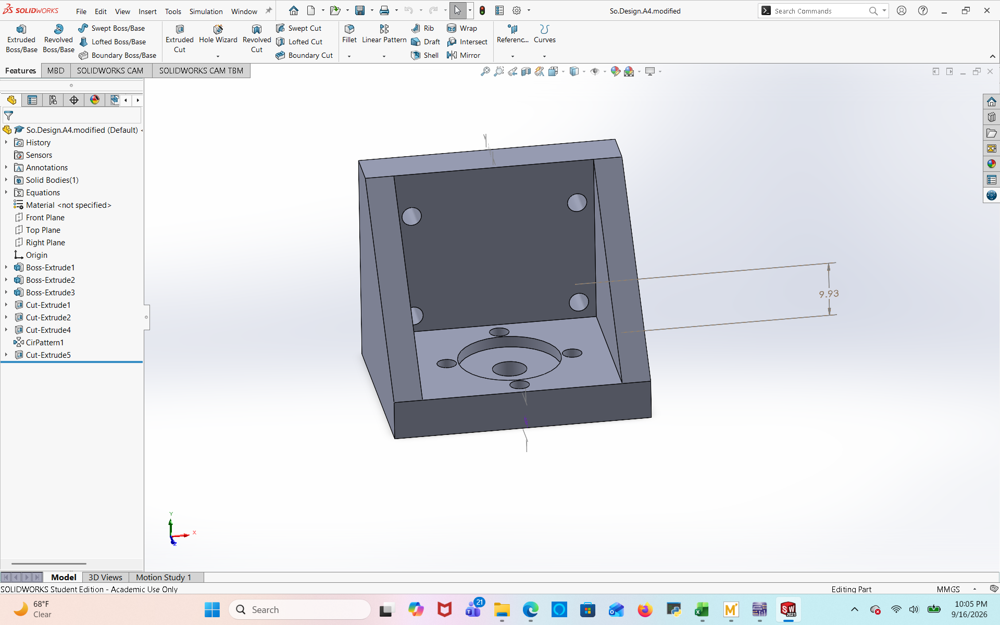
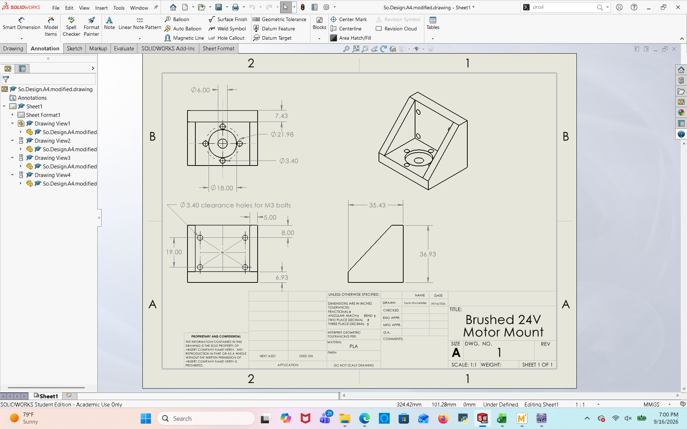

# A4 – Electric Motor Mount Design

## Objective
Design electric motor mount for given motor with an applied force

The option is given to select a material from the given list. I am choosing PLA for this project.

appendix photos

With PLA being my material of choice I sourced these values from the given link. I used the lower values that are valid at higher temperatures as I don't know the operating conditions that the motor and mount will be subjected to. 

Allowable stresses and deflections taking into consideration the safety factor of three

## Feature One

How to evaluate

For this feature, I will utilize the beam bending equation from the machinery handbook. This will require determining the moment applied to the beam or in this case the first feature of the motor mount, as well as making some assumptions about some of the mount dimensions. These assumptions are based off of the dimensions of the motor to be installed. Dimensions must at a minimum allow for fitment of the motor or allow for additional clearance. After making these assumptions, I am able to solve for one independent variable, the thickness of the feature. 

Knowns and unknowns/sketch

Manipulating the given beam bending formulas to solve for the "h" component of "I"

Numeric solution- These solutions are using a more complex formula that uses a portion of the thickness of the beam as the distance of the applied force. I switched to the simpler formula shown above when using SolidWorks and creating parametric relationships. 

The thickness when solving for stress was the higher value, so this is the thickness selected. 

## Feature two

How to evaluate-

Similar to the first feature, this feature will be evaluated with the beam bending formula. For this feature the screw hole closest to the first feature will be where the feature is no longer fixed and is able to deflect. This will be the length utilized in the formula as well as the moment arm changing magnitude. 

Knowns and unknowns/sketch

Manipulating the given beam bending formulas to solve for the "h" component of "I", this is the same as feature 1

Numeric solution- These solutions are using a more complex formula that uses a portion of the thickness of the beam as the distance of the applied force. I switched to the simpler formula shown above when using SolidWorks and creating parametric relationships. 

The thickness when solving for deflection was the higher value, so this is the thickness selected. 

Full sketch of part

## Cad Model
additional bracing for deflection
parametrics to change dimensions quickly, calculations entered incorrectly, easily fixed.
holes for motor
holes for mount
Link to download files-

[So.Design.A4.modified.zip](https://github.com/user-attachments/files/32314561/So.Design.A4.modified.zip)

Using these formulas, I was able to modify my dimensions to try different widths and thicknesses. I added the triangular braces to the motor mount which added width to the features, in turn allowing for a thinner "h" value. I was able to keep the mount quite compact and stay within the safety factor. 

In hindsight, I realize that I could have positioned the holes for the motor to mount to the part at a different orientation to keep the holes away from the edge of the part. Next time I design something on a square feature with circular cutouts I will know to change the orientation to avoid this. 

## 2157 Portion

