# A4 – Electric Motor Mount Design

## Objective
Design electric motor mount based for given motor and an applied force
instructions
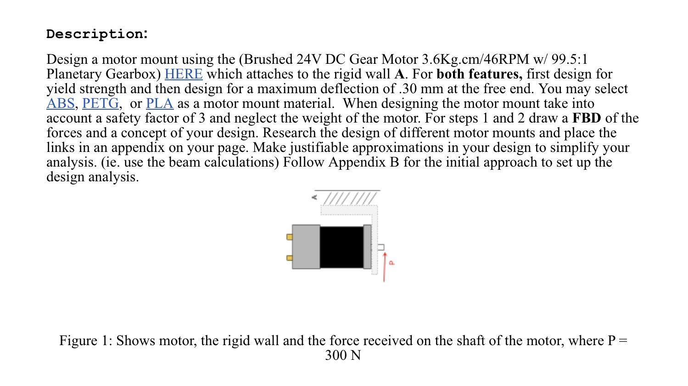
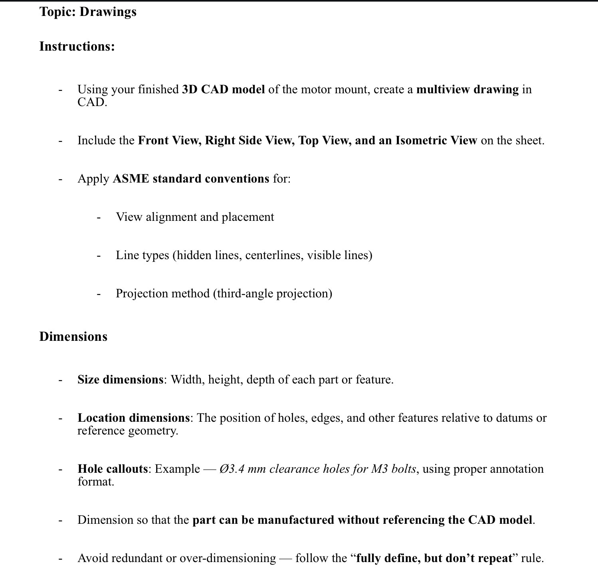

appendix photos
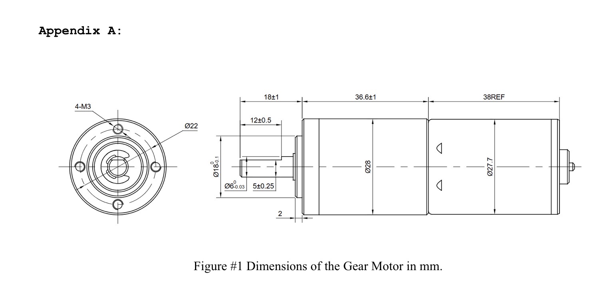
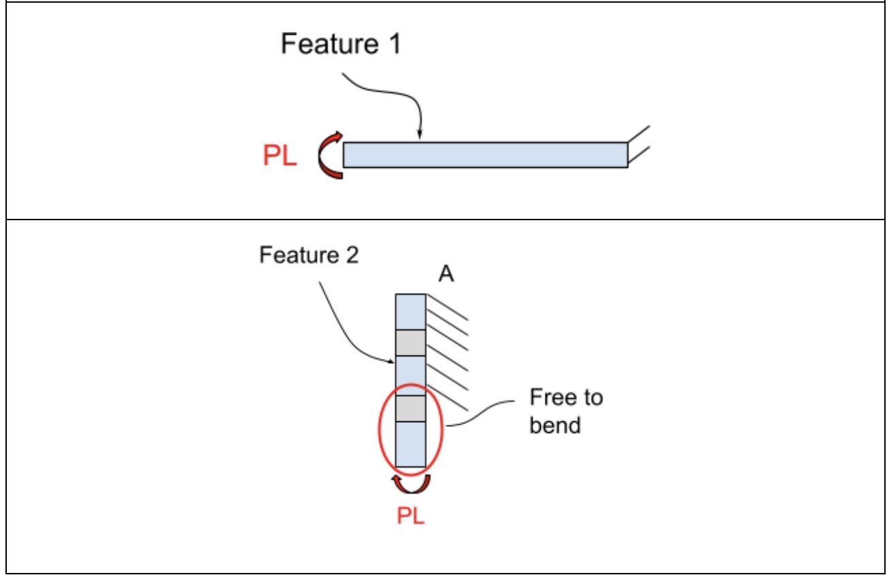
material chosen = PLA insert yield stress and Elastic modulus
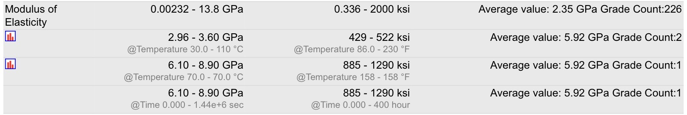

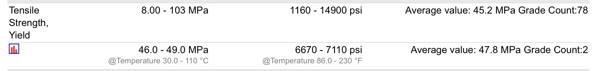
Allowable stresses and deflections
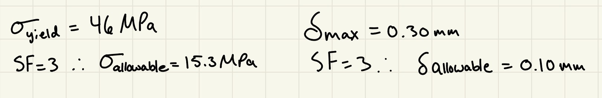

Feature One<<<
How to evaluate
For this feature, I will utilize the beam bending equation from the machinery handbook. This will require determining the moment applied to the beam or in this case the first feature of the motor mount, as well as making some assumptions about some of the mount dimensions. These assumptions are based off of the dimensions of the motor to be installed. Dimensions must at a minimum allow for fitment of the motor or allow for additional clearance. 

Knowns and unknowns
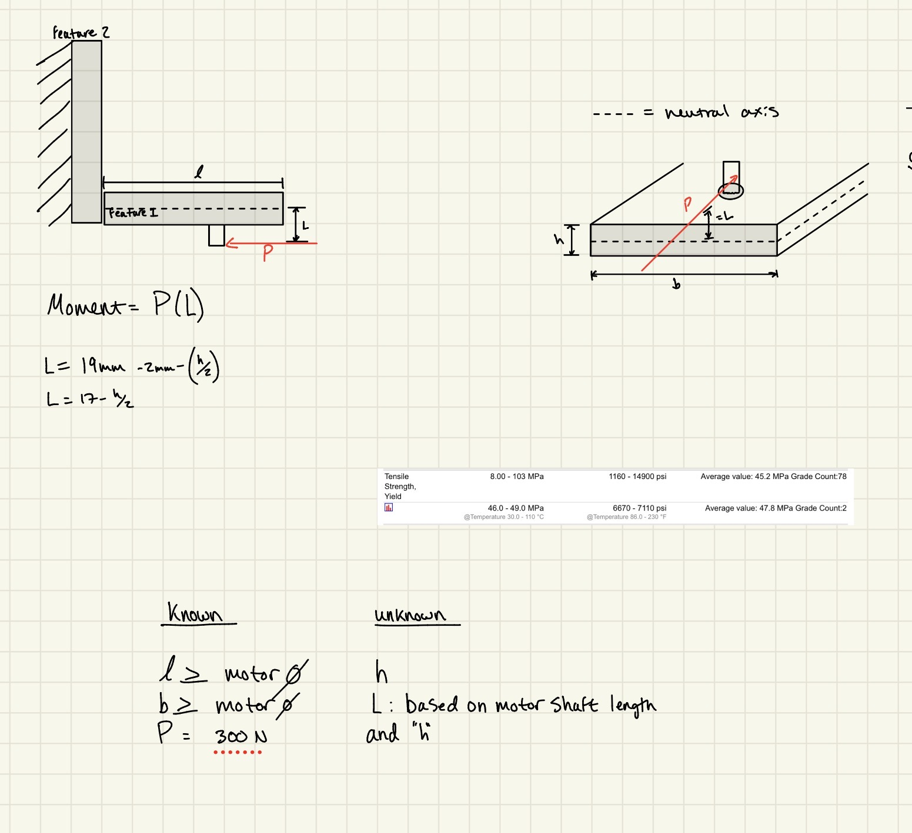
sketch

equations

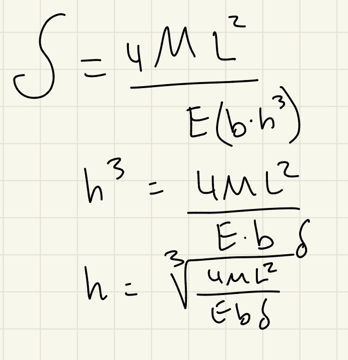
numeric solution
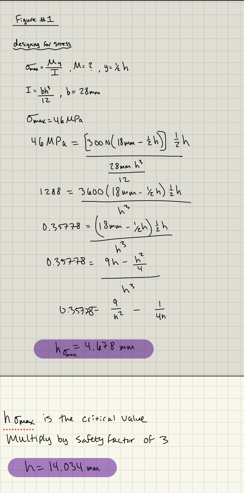
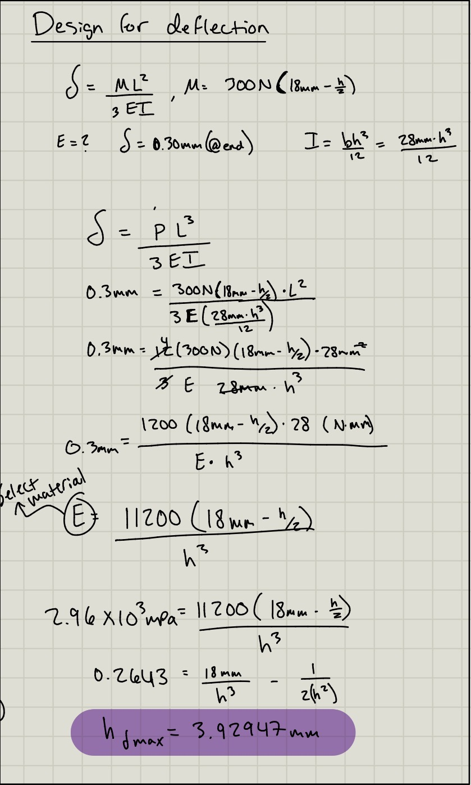

Feature two<<<
How to evaluate
Knowns and unknowns
sketch
equations
numeric solution

Full sketch of part

Cad Model<<<
additional bracing for deflection
parametrics to change dimensions quickly, calculations entered incorrectly, easily fixed.
holes for motor
holes for mount
twenty one fifty seven portion<<<
----
----
-----

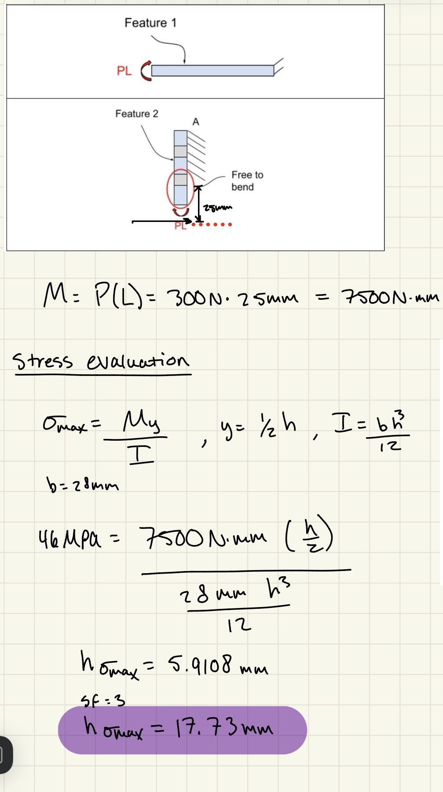
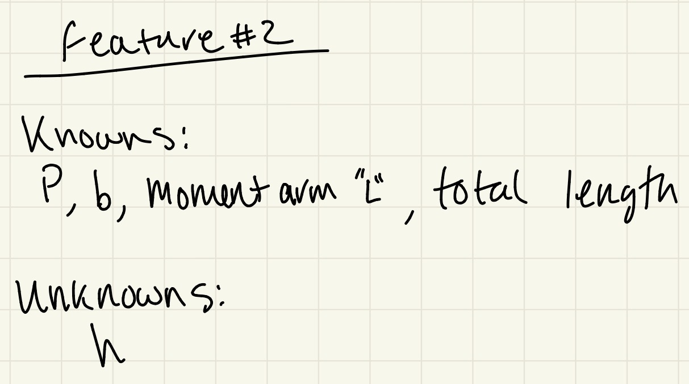
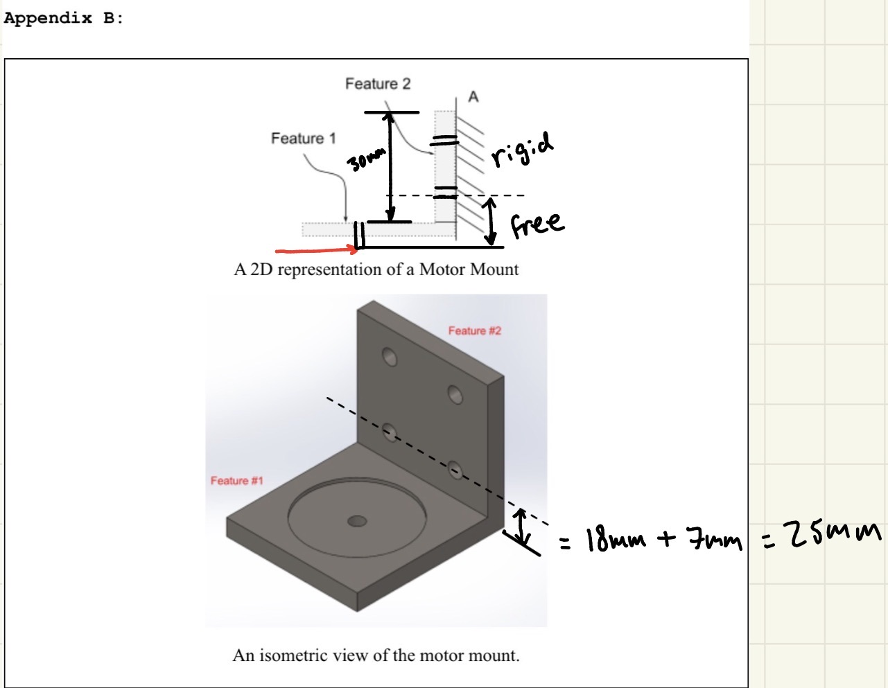

----
----
---
---

---
-----
