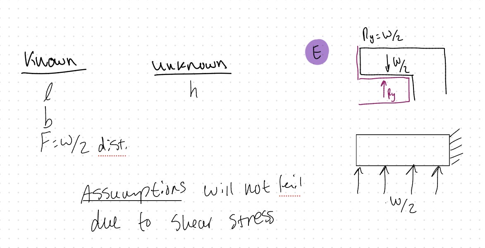
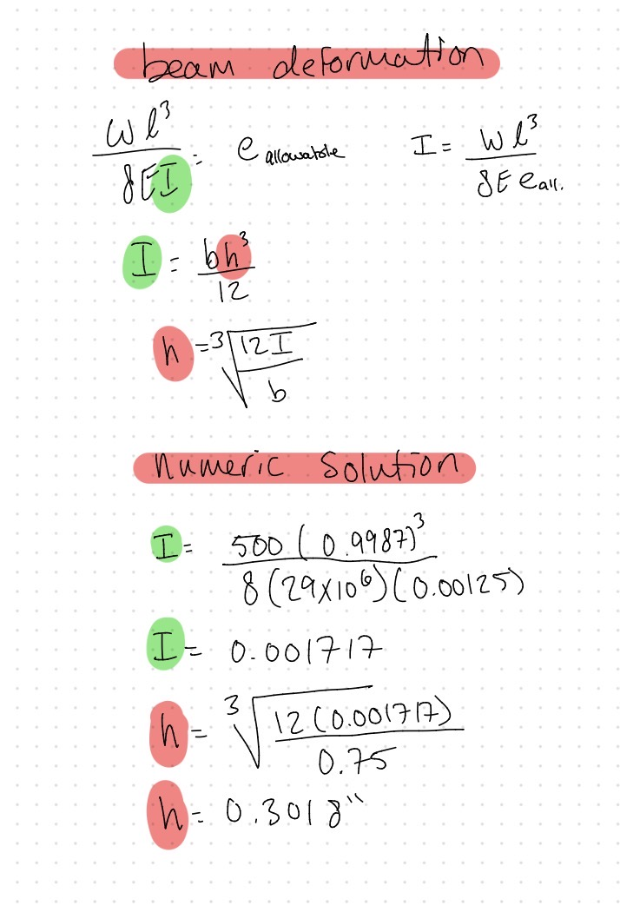

# A5 – Designing a Bracket for Strength and Stiffness

# Objective

The objective, as seen below, is to design a bracket to allow the T beam to support the load of a strap. The bracket will be designed with a safety factor of 4 and will be governed by axial and normal bending forces. My material, chosen from the approved list, will be A36 steel. 

# Stress Analysis
## Material selection and allowable stress calculation

## Feature A

Analysis method given in instructions

## Feature B

Analysis method given in instructions

## Feature C

Analysis method given in instructions

## Feature D

## Feature E

# Stiffness Analysis

## Allowable Deflection

## Feature A

Analysis method given in instructions

## Feature B

Analysis method given in instructions

## Feature C

Analysis method given in instructions

## Feature D

## Feature E

# Sketches

# Lessons Learned

# Fits (2157 only)

## Dimensional Analysis

## Feature A hole

The hole should be sized to allow for a running/sliding fit. With this information I referenced Table 8a from Machinery's Handbook 32nd editions, ANSI/ASME standard fits, running and sliding fits, table 8a located on page 654. I am using the RC class and chose the tightest tolerance in that class, which is RC1. For the one-inch shaft diameter, this calls for a (+) 0.4 thou tolerance on the hole. I will add this tolerance to the diameter of feature A assuming that it will be manufactured to that exact size. If the manufacturing to feature A is less precise, then I will add the RC1 tolerance amount to the largest size that the feature A cylinder will be manufactured to ensure that it will still fit onto the part. For the hole to be manufactured it would need to be made to a grade 5 standard which at that diameter is the 0.4 thousandths of the clearance. Grade 5 would require at least broaching to manufacture.   

## 1 inch shaft hole

This hole calls for light assembly pressure. For this I referenced the FN class of fits, in this class the FN1 is described as "Light drive fits are those requiring light assembly pressure" Page 652. For the tolerance amount I referenced table 11 and the tolerance for one inch is (+) 0.5 thousandths. I will add this to the one-inch diameter. To manufacture this, you would need to use at least a reamer, if not a more precise procedure because it is a grade 6. 

