# A5 – Designing a Bracket for Strength and Stiffness

## Objective
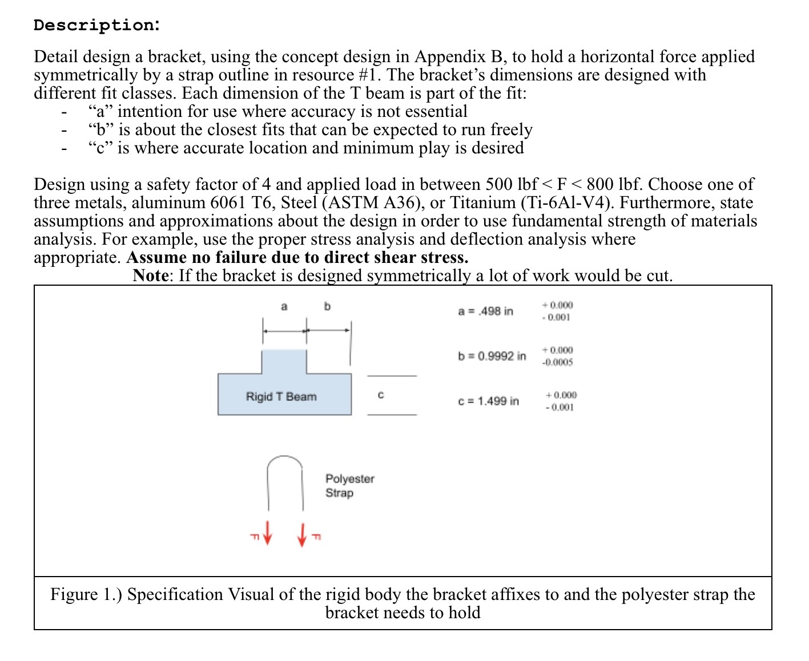
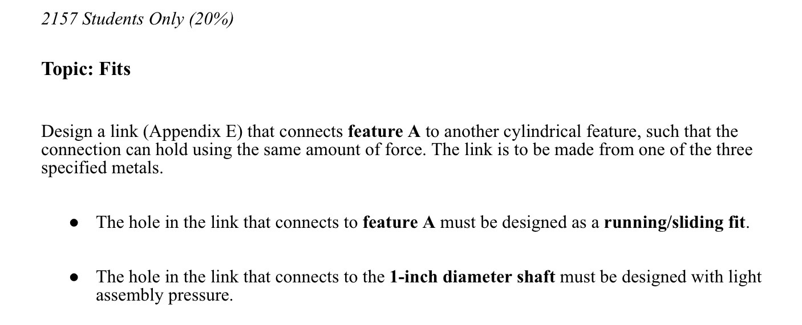

## Stress Analysis
# Material selection and allowable stress calculation

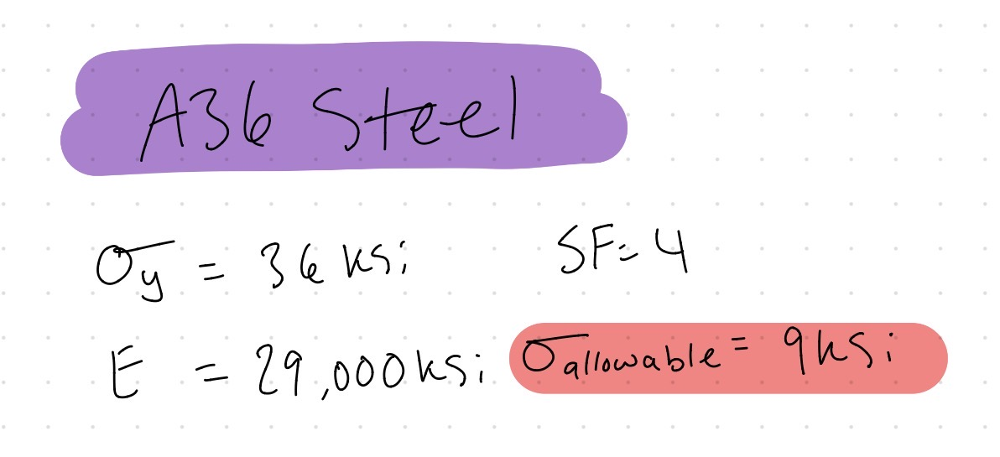

# Feature A

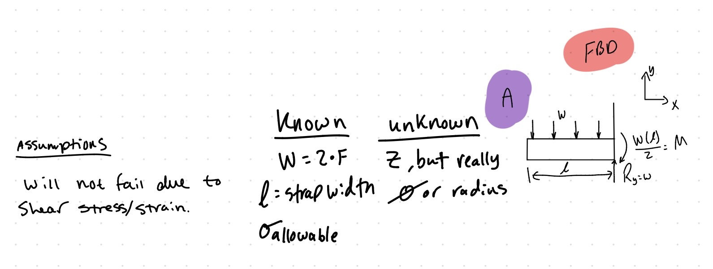

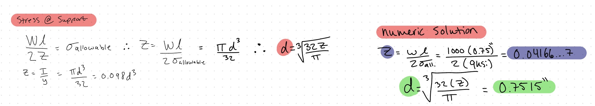

# Feature B

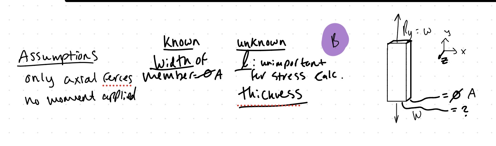

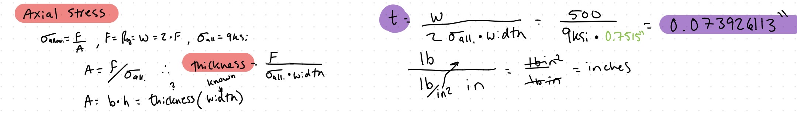

# Feature C

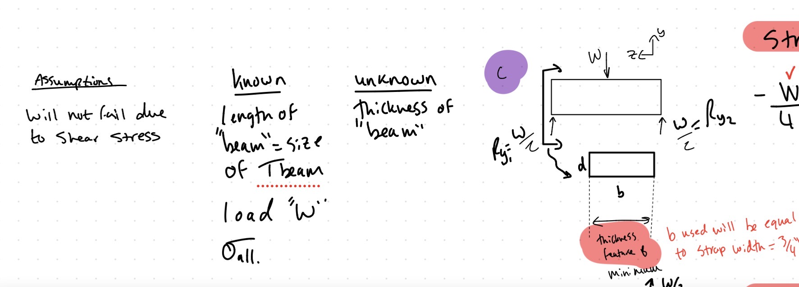

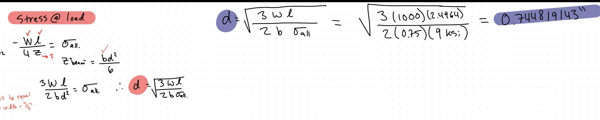

# Feature D

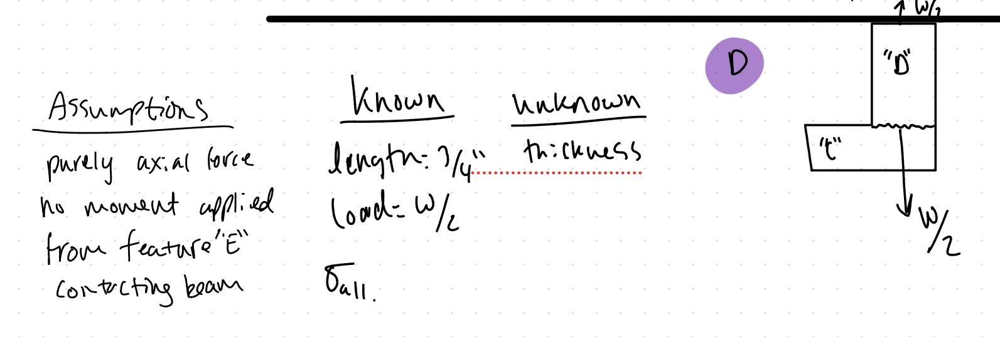

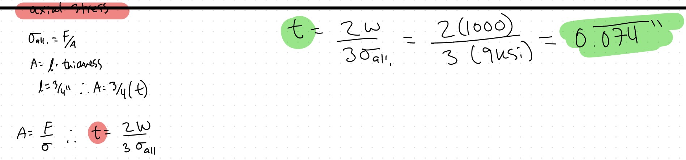

# Feature E

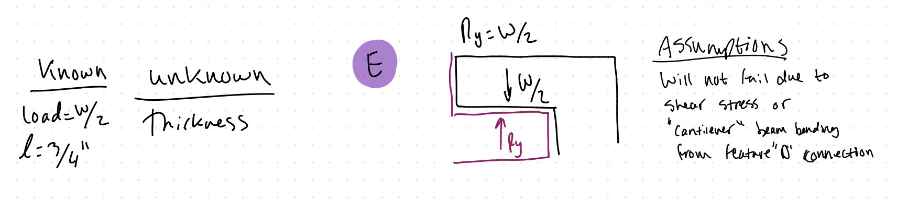

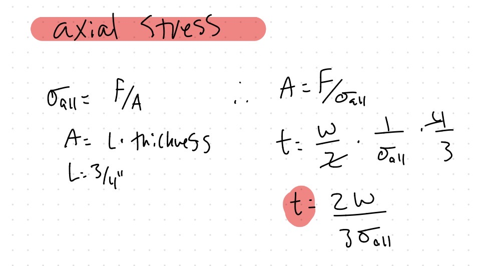

## Stiffness Analysis

# Allowable Deflection

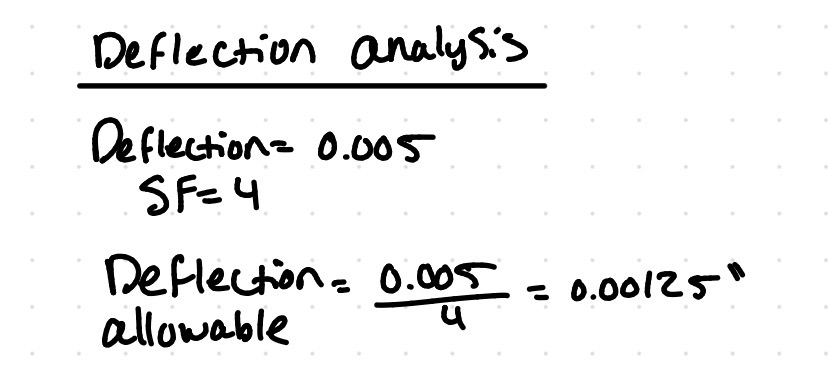

# Feature A

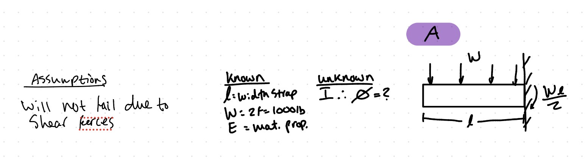

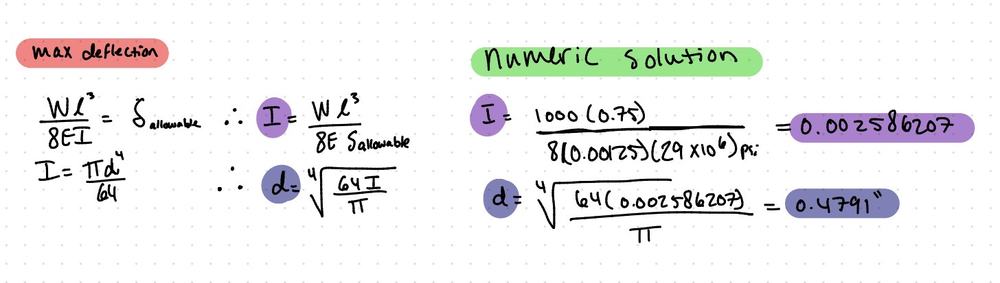

# Feature B

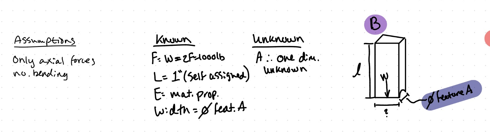

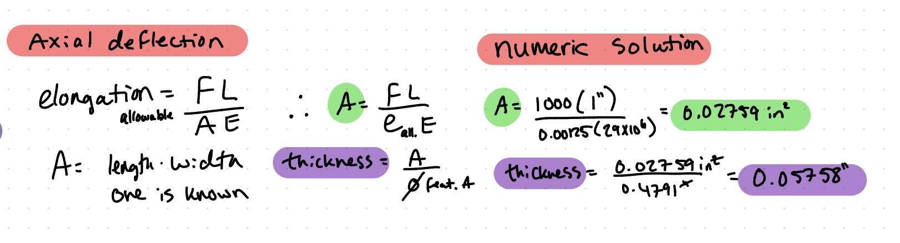

# Feature C

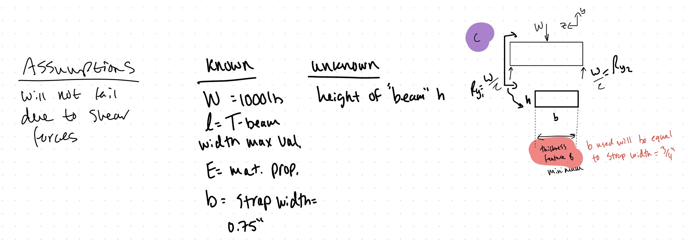

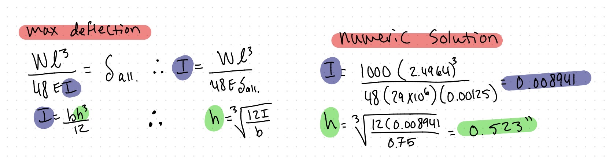

# Feature D

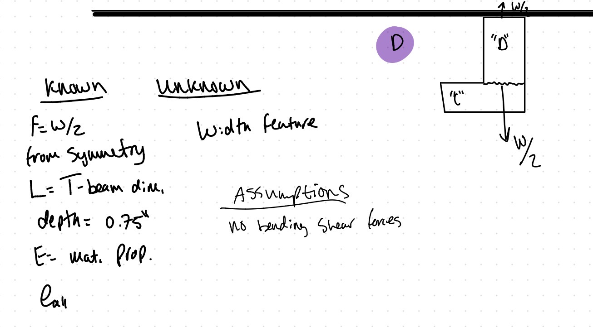

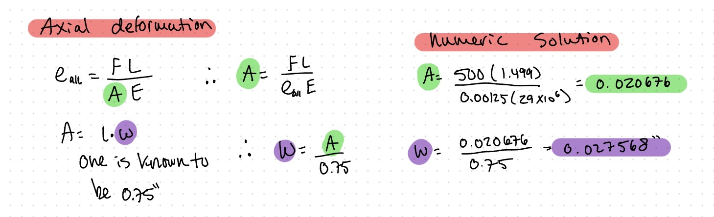

# Feature E

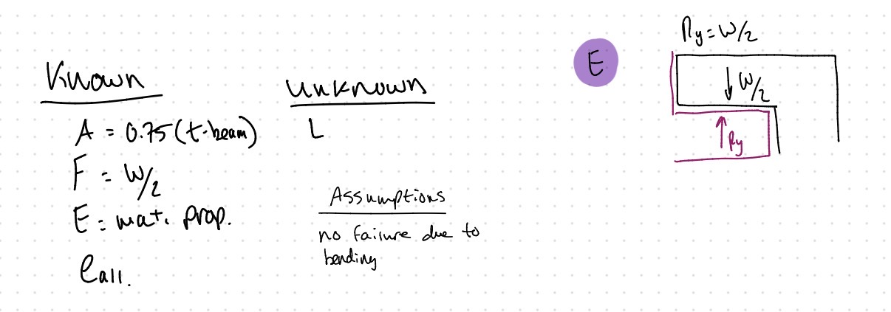

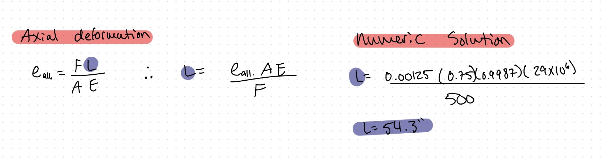

## Sketches

## Lessons Learned

## Fits (2157 only)

# Dimensional Analysis

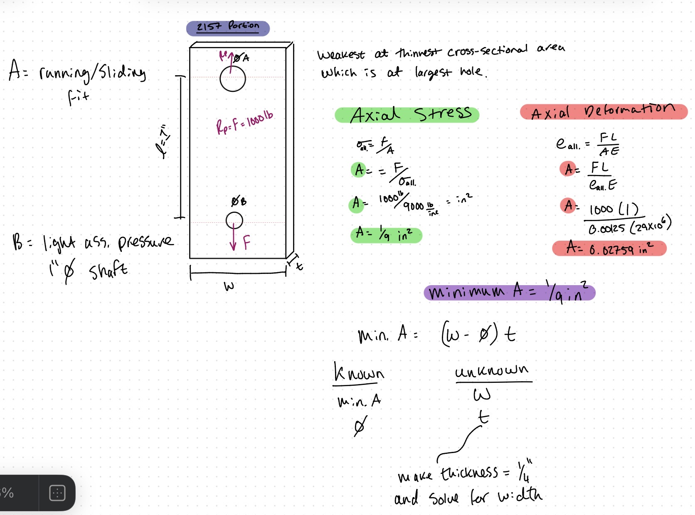

--
--

--

