# A6 – Multiview Drawing

## Objective

For this assignment I need to create a Multiview drawing of the A5 assignment. The drawing must be dimensioned with appropriate tolerances to match the fitment cases described in the original A5 assignment. 

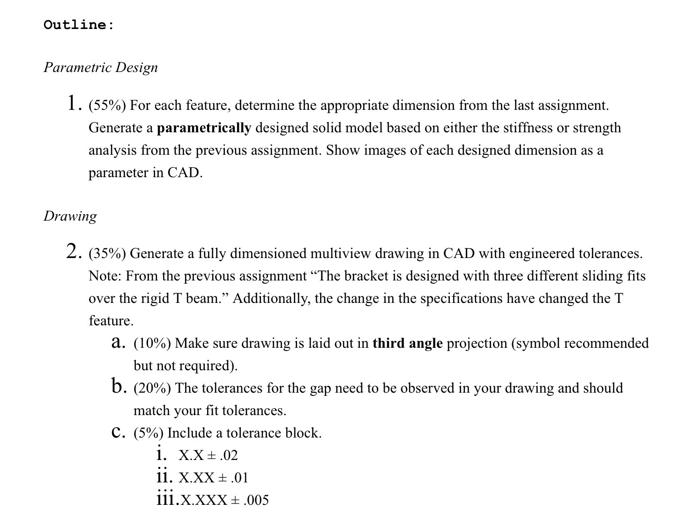

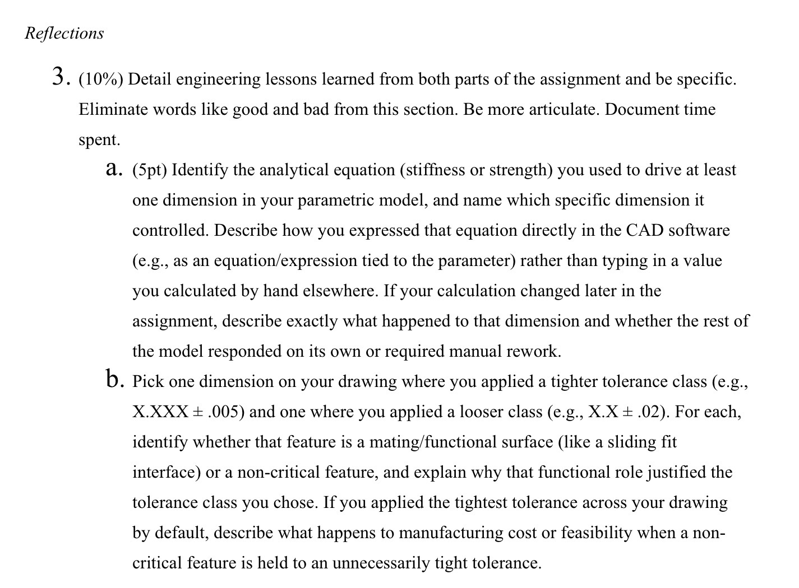

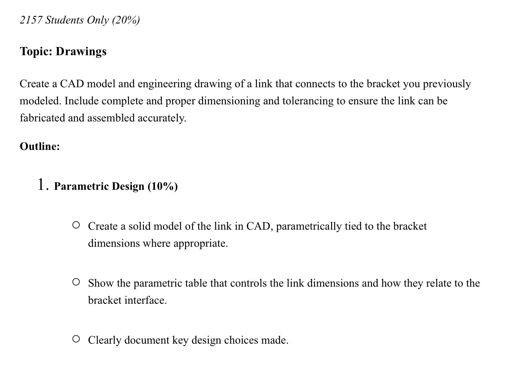

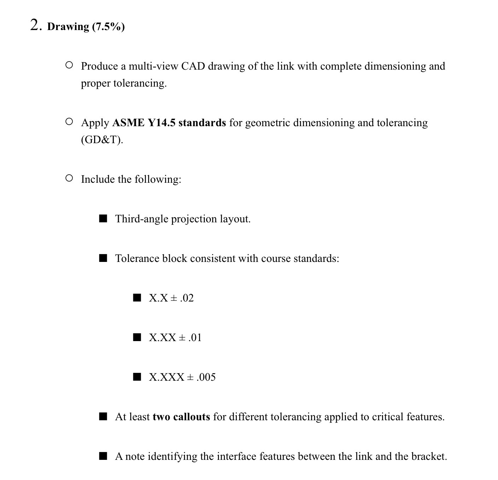

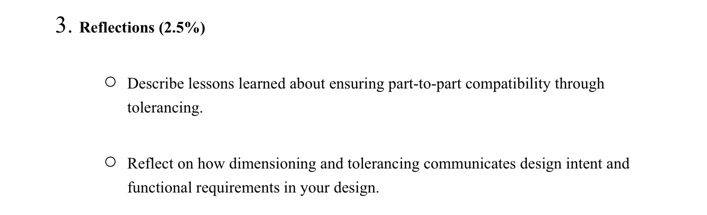

## Parametric Design

The variables and equations shown below were created in assignment A5 in order to dimension the part parametrically. The selected equations were the thickest minimum required dimensions when evaluating for maximum stress and deflection. 

The equation for the variable "d3" is written below as it does not show fully on the image. 

= ( ( "W" * "l3" * 3 ) / ( "b3" * "stressAllowable" * 2 ) ) ^ ( 1 / 2 )

.png)

## Drawing

Below are the given dimensions of the T beam that the part will contact. The descriptions of clearances are found in Machinery's Handbook on page 651 and the accompanying tables with this fit class are on pages 654 and 655. The T beam requires various levels of sliding fits. The "a","b",and "c" dimensions are labeled with their appropriately described fits. 

.png)

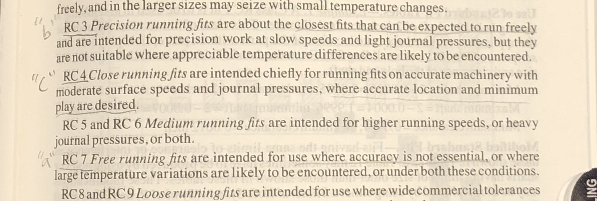

The dimensions of the fits vary in size and in their individual fits. I assessed each dimension of the T beam individually and determined what dimension range on the bracket would allow for the proper clearances. I found these dimension ranges by finding the tolerance that the T beam is manufactured to and the proper clearance for their fit classes. With this information I was able to create a range of dimension of the bracket that allowed their fitment relationship to stay within the allowed range with either parts maximum or minimum sizes. The tolerances will be shown on the Multiview drawing to enable manufacturing of the part to the proper specifications. 

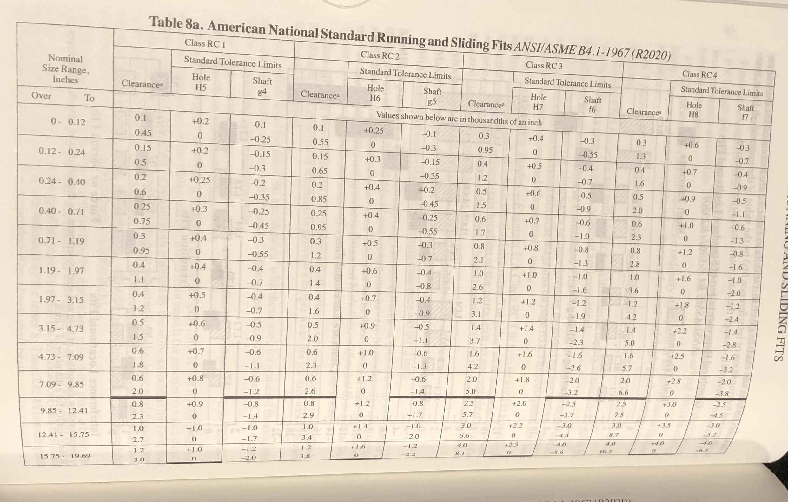

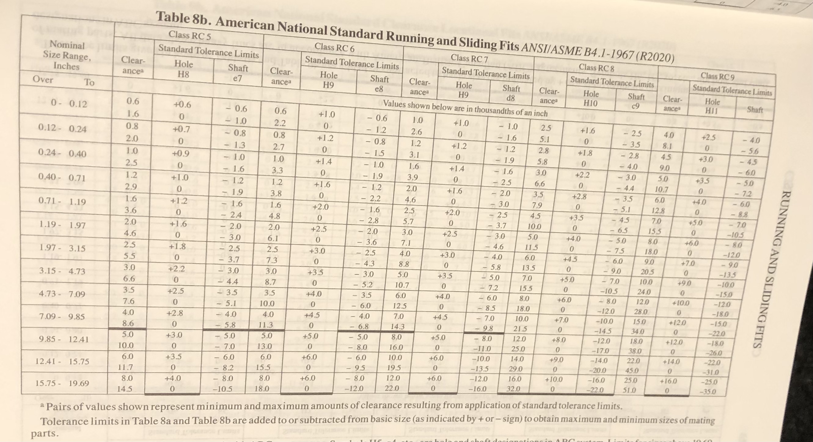

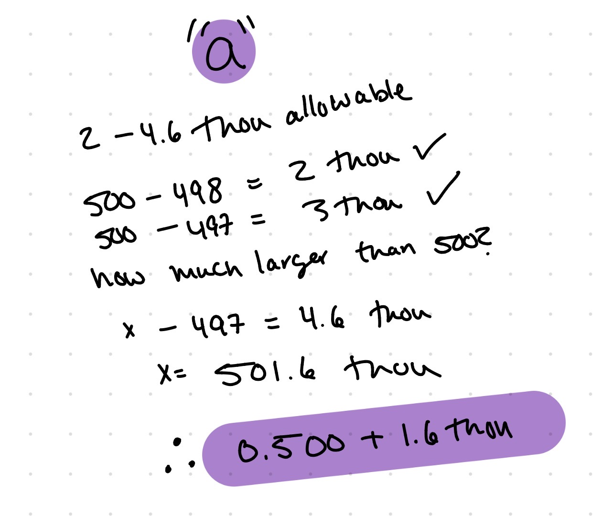

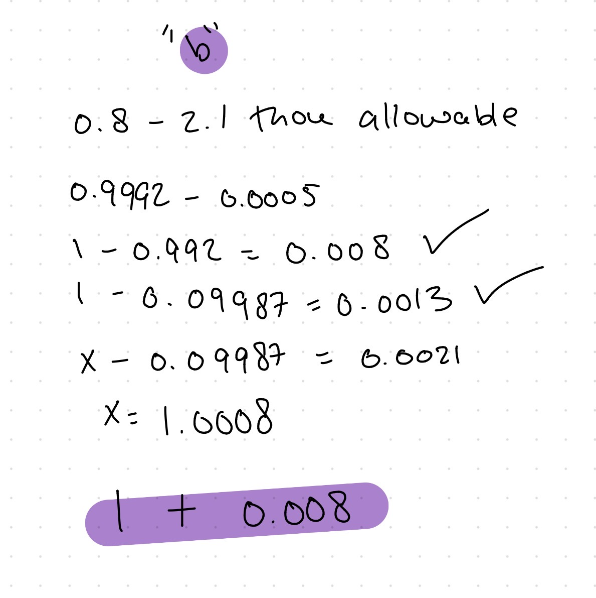

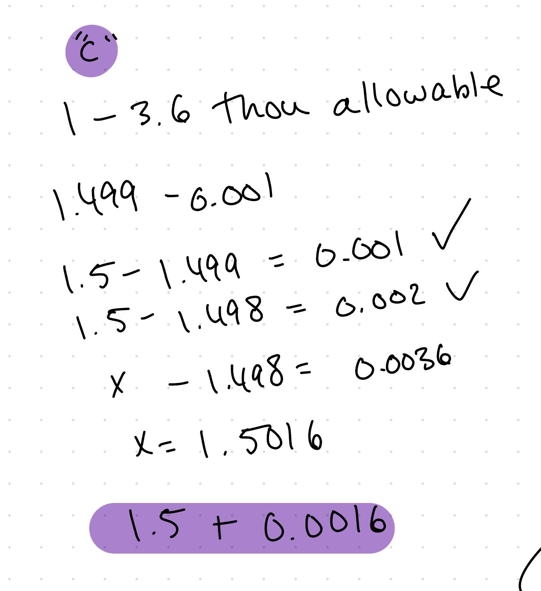

## Reflections

## 2157 Assignment (Drawings)

# Parametric Design

# Drawing

# Reflections

.png)

.png)

